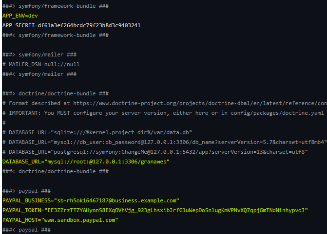
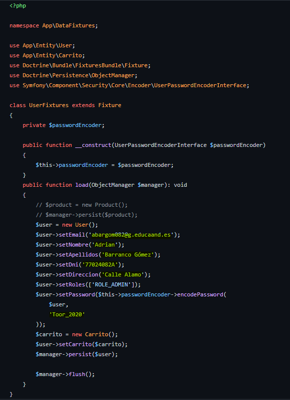

<!-- ---
hide:
  - navigation
  - toc
--- -->

# Instalación de la aplicación

## Prerequisitos
Dicha aplicación esta creada con symfony por lo que necesita tener el hosting algunas aplicaciones ya instaladas:

- PHP > 8.0
- Composer
- nginx o apache
- NPM

Una vez se clone la aplicacion necesitas realizar algunas configuraciones iniciales, lo primero es en el archivo **.env** cambiar el modo de entorno al que desees si va a estar en produccion o en modo desarrollo, en ese mismo archivo tendras que establecer tus propias claves de paypal, tambien establecer el tipo de conexion de base de datos que tendrás.

## Configuracion inicial

Una vez todo lo anterior este realizado vamos a requerir el paquete necesario para que funione bien symfony, desde la consola de nuestro servidor donde alojamos nuestra aplicación nos vamos al directorio raiz de la aplicación y lanzamos el siguiente comando:

~~~
granaweb@hosting-granaweb:/var/www/GranaWeb$ composer require symfony/runtime
~~~

Una vez realizado esto necesitamos instalar todos lo paquete necesarios que utiliza la aplicación. Para ello vamos a realizar el siguiente comando, desde la raiz de nuestra aplicación:

~~~
granaweb@hosting-granaweb:/var/www/GranaWeb$ npm install
~~~

Una vez termine de instalarlos ya tenemos nuestra aplicación perfecta para iniciarse, el siguiente paso es crear la base de datos.

## Creacion de la base de datos

Una vez se ha realizado el paso anterior vamos a crear la base de datos, si tenemos acceso a ella podemos crear una base de datos vacio, de lo contrario si nuestro usuario de base de datos dispone de permisos suficiente para poder crearla se puede realizar con el siguiente comando, lanzado desde el directorio raiz:

~~~
granaweb@hosting-granaweb:/var/www/GranaWeb$ php bin/console doctrine:database:create
~~~

Este comando anterior lo que hace es crear la base de datos vacia, para poder crear las tablas necesitamos realizar el siguiente comando:

~~~
granaweb@hosting-granaweb:/var/www/GranaWeb$ php bin/console doctrine:migration:migrate
~~~

Este comando lo que hace es crear todos las tablas vacias de nuestra aplicación, de momento no hay ni usuario, ni productos, es decir, esta todo vacio, para poder crear el usuario administrador podemos modificar el archivo **"UserFixtures.php"** que se encuentra en **"src/DataFixtures"**, estableciendo los valores de nuestro usuario administrador:

Los campos que estan en amarillo son los que se pueden cambiar para modificar el usuario administrador con nuestras credenciales.

Para poder cargar esto necesitamos realizar el siguiente comando, de igualmente que los anteriores desde el directorio raiz de nuestra aplicación:

~~~
granaweb@hosting-granaweb:/var/www/GranaWeb$ php bin/console doctrine:fixtures:load
~~~

Una vez termine ya podemos ir a nuestro navegador y acceder con la credenciales que hemos establecido en el archivo anterior.