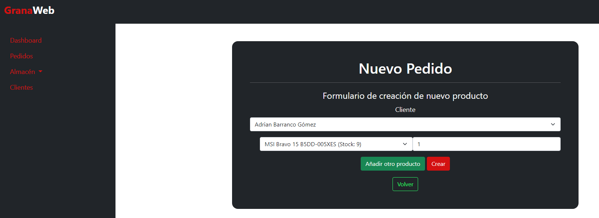

# Gestión de pedidos

En esta web los pedidos se pueden hacer de dos maneras la primera es que un dependiente de la tienda realice una ventas entonces la puede registrar desde la web, de esta manera todo queda registrado. Otra opción es que un usuario registrado pueda realizar un checkout de los productos que tiene su carrito. Tambien hay que recalcar que solo pueden realizar compras en la pagina web usuario que previamanete se han registrado en ella.

Esta es la vista normal de pedidos, en esta lista se mostraran todos los pedidos, aqui podemos ver el campo ID de transacción que es el ID de la compra de paypal, con esa cadena puedes irte a paypal y ver mas informacion sobre la compra.
Tambien hay dos botones, en el apartado Acciones:

- Ver: este boton te lleva a la vista donde se muestran todos los datos del pedido realizada
- Editar: este boton te lleva a una vista para modificar el estado del pedido.

## Creacion de pedido manuales

Esta opción se encuentra en el menu de backoffice **Pedidos**, si accedes se verán todos los pedidos realizados tanto online o por la tienda. Para poder crear un pedido manual basta con darle al botón **Nuevo pedido** y se cargará un formulario para la creacion de un pedido nuevo, es importante que primero se cree el usuario, ya que si no, no te dejará hacer el pedido.

Como podemos ver tenemos un desplegable para seleccionar el cliente al que se le vinculará el pedido, lo siguenete es otro desplegable con un campo de tipo texto, el desplegable es para seleccionar el articulo que se vende y el otro capo de texto es para introducir un número que es la cantidad que se compra de ese articulo.

Después vemos otros tres botones:

- Añadir otro producto: este botón sirve para añadir mas productos al pedido.
- Crear: este botón sirver para guardar el pedido en la base de datos.
- Volver: este botón sirver para volver a la vista de inicio de pedidos.

## Ver toda la informacion sobre un pedido.

Para ver toda la información sobre un pedido tenemos un botón en la vista principal que te lleva a una vista donde te muestra dicha información, el botón en cuestión es **Ver**, lo que muestra seria lo siguiente:

Como pedemos ver tenemos tres botones:

- volver: este botón nos devuelve a la vista principal de pedidos.
- Modificar estado: este botón nos lleva a la vista para modificar el pedido.
- Eliminar: este botón elimina el pedido en cuestión.

## Modificar el estado del pedido

Los pedidos en esta aplicacion tiene varios estados, los estados disponibles son los siguientes:

- Pendiente: este estado es antes de que se confirme que se ha pagado el pedido. 
- Pagado: este estado se establece cuando se paga un pedido.
- Preparado: este estado se establece cuando se prepara un producto para enviarse 
- Enviado: este estado se establece cuando se envía todo del pedido.

En esta vista podemos apreciar un desplegable para seleccionar el estado del pedido y ademas tres botones:

- Actualizar: este botón actualizara el estado del pedido al seleccionado.
- Volver: este botón nos devolvera a la vista inicial de pedidos.
- Eliminar: este botón elminará el pedido.

