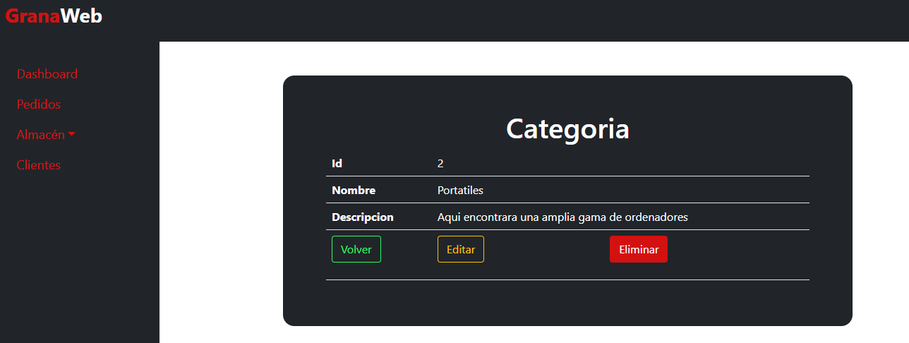
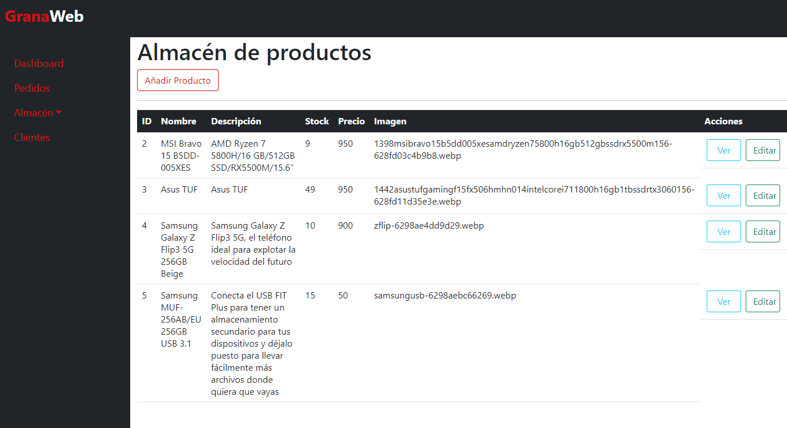

# Gestión del Almacén

Para gestionar productos se realiza desde el backoffice en el apartado del menu **Almacén** el cual contiene dos enlaces uno para crear categorias y otro para crear productos, es importante que antes de añadir un producto crees la categoria primero, dichas categorias apareceran de manera automatica en el menu principal.

## Categorias

### Creación de una categoria

Para crear una categoria tienes que ir al backoffice y seleccionar el apartado **Almacén** y dentro de él, **Categoria**, como podemos apreciar en la siguiente imagen:

[![imagen_categorias]](./assets/img/categorias.png)

[imagen_categorias]: ./assets/img/categorias.png

Para crear una categoria simplementen le damos a **Crear nueva** y nos llevara a un formulario donde deberemos introducir todos los datos para crear una categoria nueva.

### Ver información de una categora

Para ver una la informacion de una categoría, en el la página principal de categorias en cada categoria nos saldra unos botones en el apartado **Acciones**:

- Ver: con este boton te saldrá toda la informacion de esa categoria
- Editar: con este boton te llevara a una nueva vista en la que podras modificar todos los datos de la categoria en cuestión.

Si le damos al boton de ver nos llevara a esta vista, mostrandonos toda la informacion de dicha categoria:

En esta vista podemos apreciar tres botones:

- volver: este botón nos devolverá a la pagina donde se miestran todas las categorias.
- editar: este botón nos llevara a la vista de editar dicha categoría.
- Eliminar: este boton eliminara dicha categoría.

### Editar informacion de un categoría

Para modificar la información de una categoría disponemos de dos botones uno en la vista inicial donde se listan todas la categorias y otra desde la vista donde vemos la informacion de una categoria, ambos botones llevan al mismo sitio.

En esta vista podemos apreciar tres botones:

- Actualizar: este botón guarda la información que este en el formulario en la base de datos.
- Volver: este botón te devuelve a la página donde se listan todas las categorias.
- Eliminar: este botón elimina dicha categoria.

## Productos

### Listar el almacen

Para ver todos los productos que disponemos en nuestra tienda, solo tenemos que irnos al apartado **Almacén** y dento de el **Productos** una vez dentro nos listará todos los productos que tenemos en la base de datos.

Como podemos apreciar vemos al final de cada producto, en el apartado **Acciones**, dos botones:

- Ver: este botón nos llevará a una vista para ver la información más detallada del producto.
- Editar: este botón nos llevara a una vista donde nos saldrá un formulario para modificar la informacion de dicho producto.

### Creación de un producto

Para crear un producto nuevo le podemos dar al boton de **Añadir Producto**, dicho botón no llevara a una vista donde aparace un formulario para introducir los datos del producto.

En esta vista disponemos de dos botones:

- Guardar: este botón guardará la información que este en el formulario en la base de datos.
- Volver: este botón nos devolvera a la vista donde se listan todos los productos.

### Ver información de un producto

Para ver la toda la información de un producto solo tenemos que darle al botón que hemos visto más arriba de **Ver** y nos llevará a la vista siguiente:

En esta vista disponemos de tres botones:

- Volver: este botón nos devolverá a la vista anterior.
- Editar: este boton nos llevara a la vista para modificar el producto.
- Eliminar: esto boton eliminara el producto.

### Editar información de un producto

Para editar un producto podemos hacerlo desde la vista inicial donde se ven todos los productos o desde la vista donde se muestra toda la información del producto.

En esta vista podemos apreciar tres botones:

- Actualizar: este botón guardará los cambios en la base de datos.
- Volver: este botón nos devolverá a la vista principal de los productos.
- Eliminar: este botón eliminará el producto.
