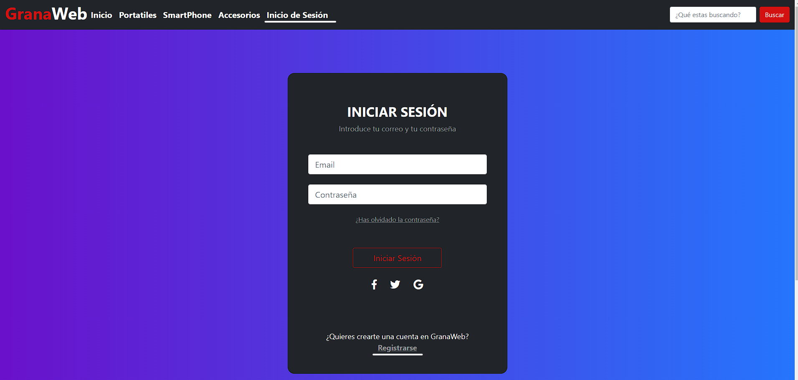
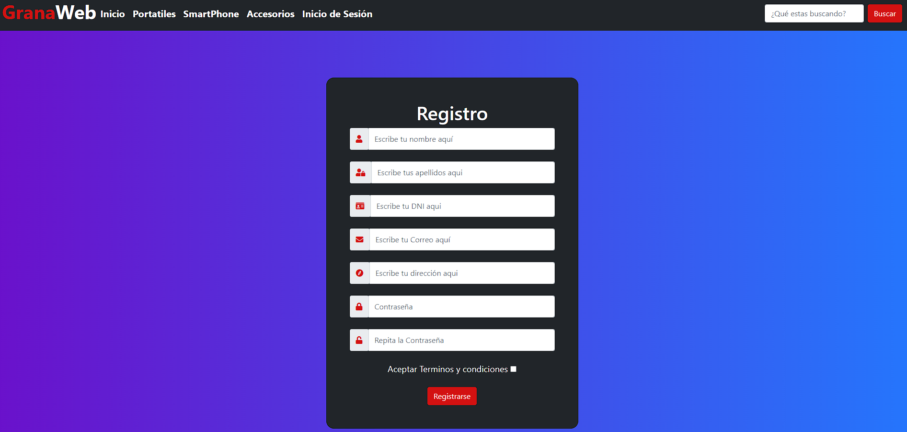
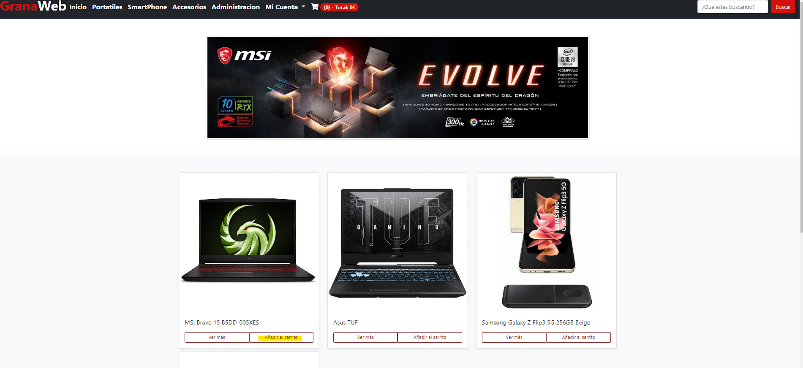
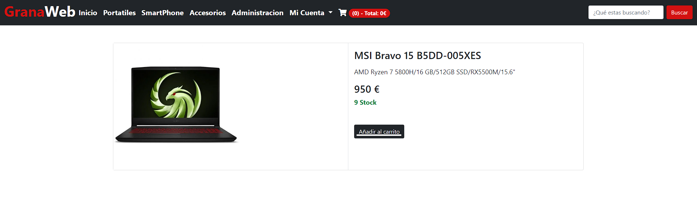
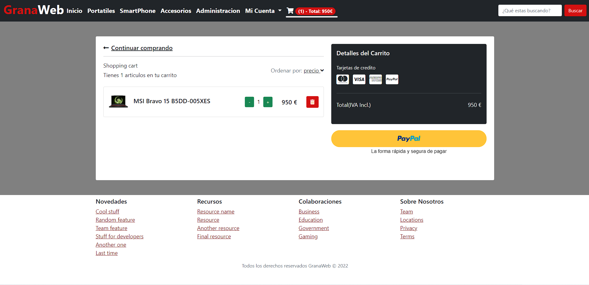
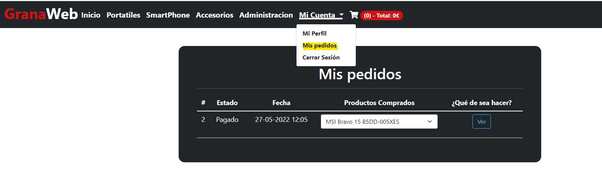
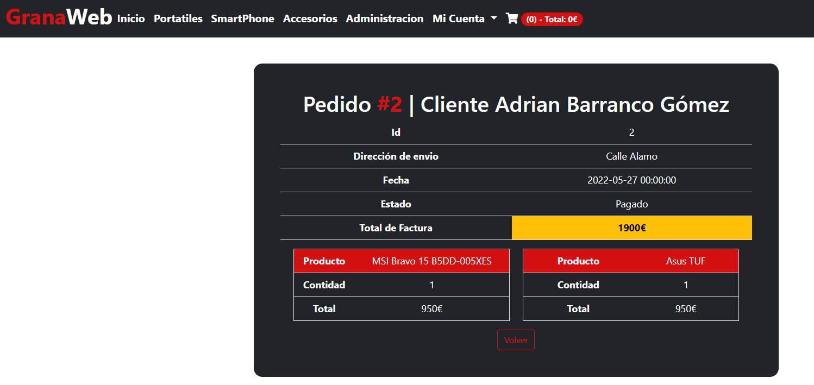
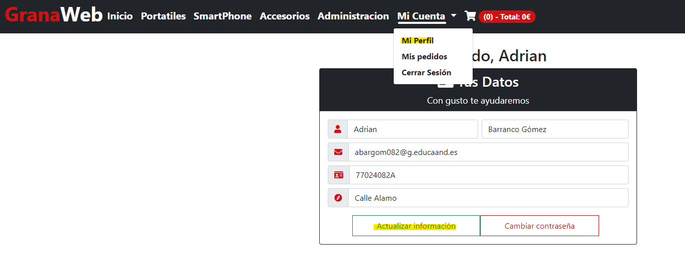
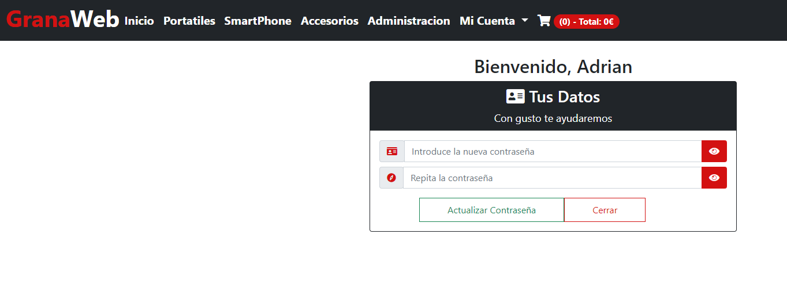

# Guía de Usuario

## Registro de usuarios

Para poder registrarse en GranaWeb lo puedes realizar desde el enlace del menu **inicio de sesión**, justo debajo hay un enlace para poder registrase, en el que nos pedira rellenar un formulario.

Una vez entre en el registro saldrá el siguiente formulario:

Una vez complete el formulario le llevara a la pagina para iniciar sesión en la pagina y su cuenta estará operativa para realizar transacciones.

## ¿Como realizar una compra?

Para poder realizar compras en GranaWeb necesita iniciar sesión de lo contrario no podrá añadir ningun producto al carrito.
Para añadir un producto al carrito puede hacerlo desde la pagina donde se listan o desde la vista del producto en cuestio:

- Vista desde lista:

- Vista producto:

Una vez agregado el producto al carrito se tiene que ir a la vista de carrito:

Como podemos ver tenemos varios botones a lo largo de la pagina.

- Botón con una papelera: este botón elimina el artículo definitivamente de su carrito.
- Botón + y - : estos botones aumentan o disminuye la cantidad del producto en cuestión.
- Botón paypal: este botón procede a pagar la compra, la compra se gestiona a través de paypal.

Una vez finalice la compra se vaciará el carrito para poder llenarlo con nuevos productos.

## ¿Como puedo ver mis pedidos?

Para ver tus pedidos realizados en GranaWeb, puedes hacerlo en el enlace del menu **Mi Cuenta->Mis pedidos** en esa vista se mostraran todos los pedidos realizados en la web, podiendo ver todos los detalles del mismo.

Como vemos en la vista podemos apreciar un boton en el que pone **Ver** el cual sirve para visualizar toda la información sobre el pedido. Si le das te llevara a una vista similar a esta: 

## ¿Como cambiar mis datos o contraseña?

Para poder cambiar algún dato o cambiar tu contraseña tienes que iniciar sesión e ir al apartado de **Mi cuenta->Mis datos** en dicha vista te aparecerá un formulario relleno con tus datos, si quieres cambiar algo basta con modificar el campo necesario y darle al botón **Actualizar información**:

De lo contrario si lo que queremos es cambiar la contraseña en la misma vista hay un botón **cambiar contraseña** que nos muestra un formulario para poder cambiar la contraseña de nuestro usuario:

