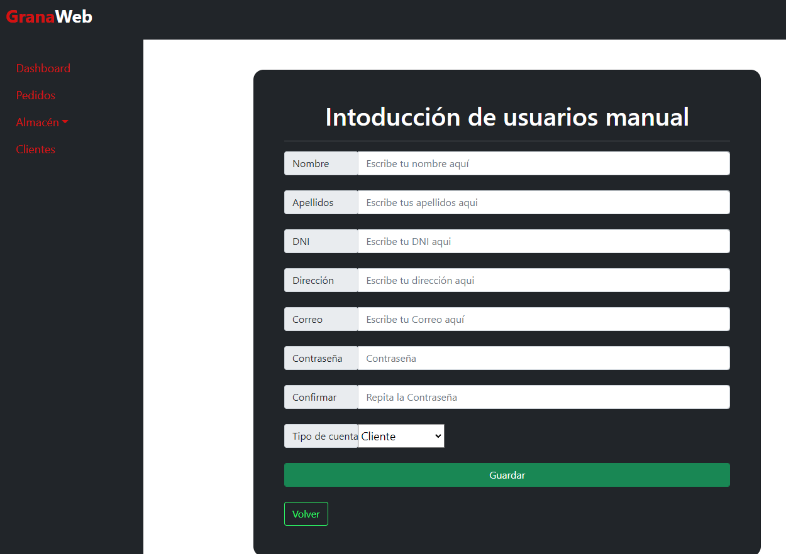
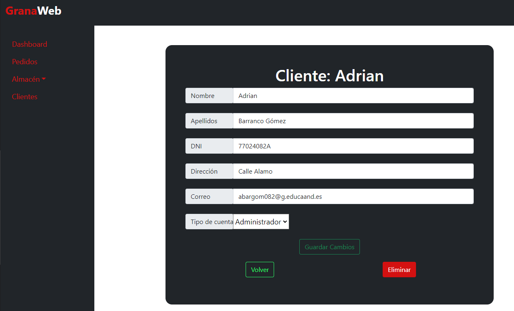

# Gestión de usuarios

Esta aplicación esta orientada a una tienda web, pero en caso de tener tienda fisica se puede utilizar la aplicacion web también. Ya que se pueden crear clientes/usuarios desde la misma aplicación de tal manera que se lleve un regitro de quien compra cualquier producto.

## Menu de clientes

En esta aplicación hay dos tipo de usuarios una sería cliente y otro sería administrador, este ultimo es el unico que va a poder acceder al backoffice.

Una vez dentro del backoffice nos vamos a clientes y nos cargara todos los cliente de nuestra aplicación.

El registro en la aplicacion puede ser manual o directamante que el usuario se registre con un formulario.

## Crear un usuario manual

Para crear un usuario hay que darle al boton de Añadir Cliente Manual y completar el formulario siguiente:

## Ver datos y modificar usuarios

Para ver los datos de un usuario, desde **Clientes** nos saldrán todos los clientes de la aplicación un hay un campo llamado acciones en el que podemos ver los datos del usuario o directamente modificar algun dato.

Si le damos al boton de ver se nos abrira una vista con todos los datos del usuario seleccionado.

Desde esta vista podemos ver tres botones:
- volver: nos devuelve a la vista anterior donde se listan todos los usuarios
- editar: nos llevara a otra vista en la que nos saldrá un formulario para modificar datos del usuario, es la misma vista que en el boton del listado de clientes.
- Eliminar: nos eliminara el usuario que estamos visualizando.

Si le damos al boton de editar nos llevará a la vista en la que tenemos un formulario para editar el cliente.

En esta vista se podrán modificar todos lo valores del formulario anterior, tambien nos aparecen tres botones:
- Guardar Cambios: Se guardarán todos los datos que se hayan modificado.
- Volver: volverá a la vista donde se listan todos los usuarios. 
- Elimiar: Eliminara dicho usuario.

En este formulario es donde puedes cambiar el tipo de usuario que es un cliente, es decir, si es usuario o administrador.
